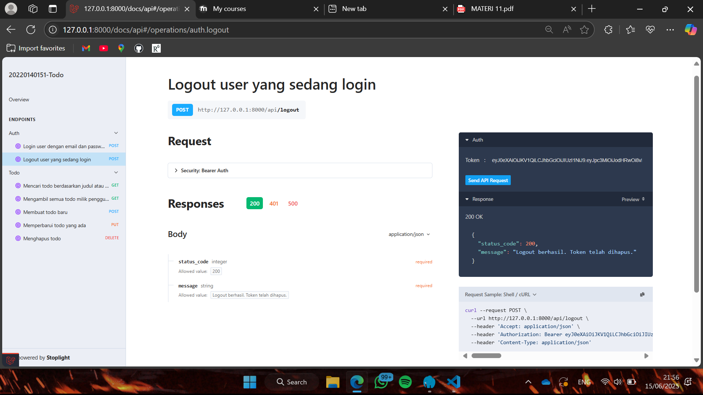
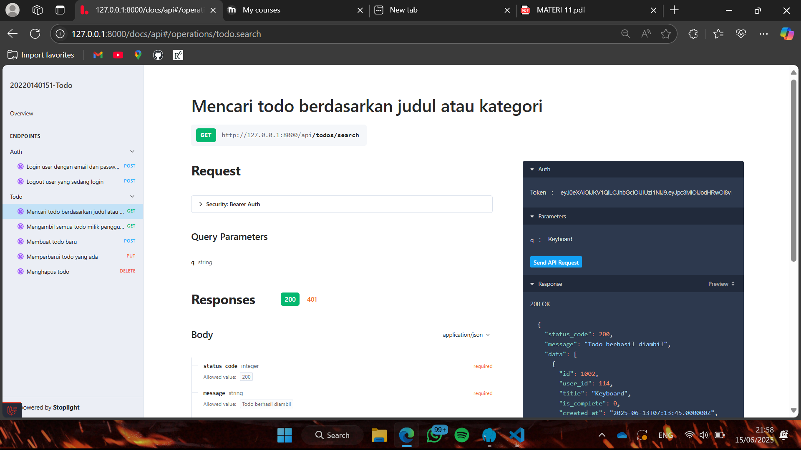
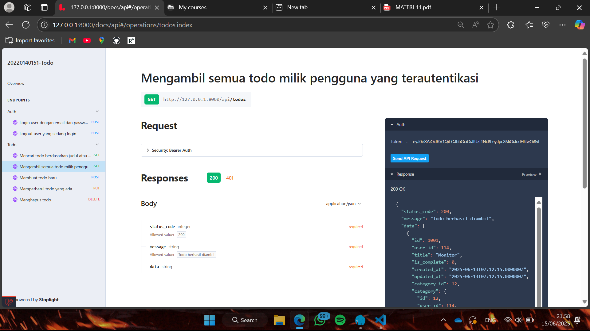
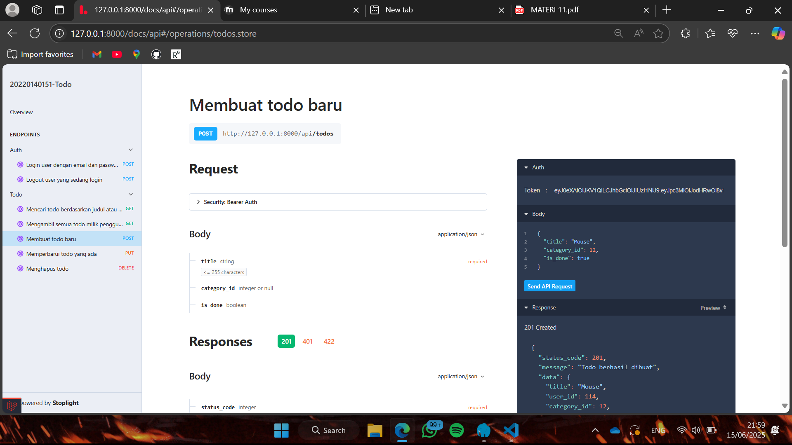
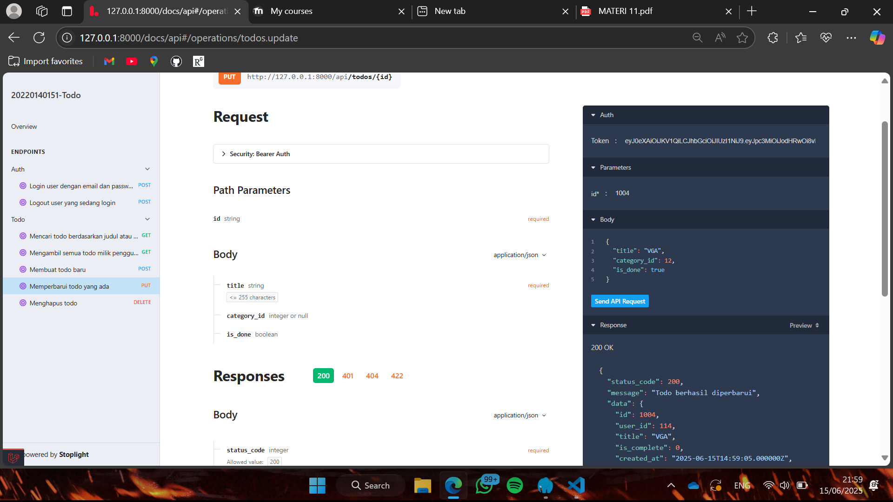
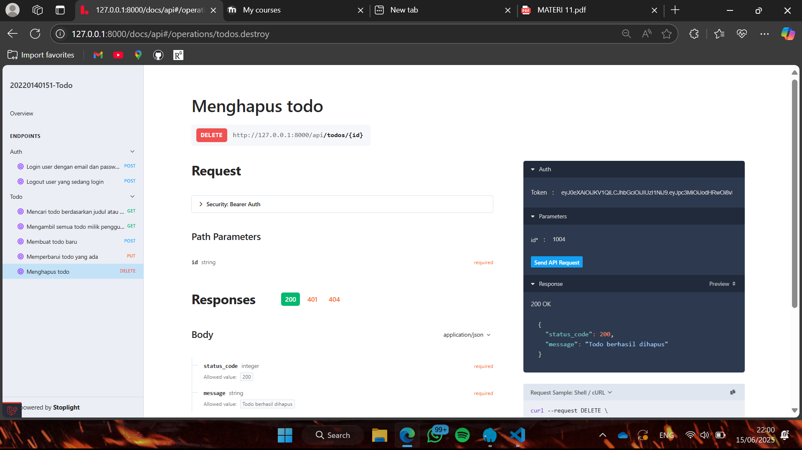

# Tugas 11

# 1. Logout

# 2. Endpoint untuk melakukan pencarian pada Todo

# 3. Endpoint untuk mengambil semua data 

# 4. Endpoint untuk menambah data Todo baru

# 5. Endpoint untuk mengubah Todo

# 6. Endpoint untuk menghapus Todo

